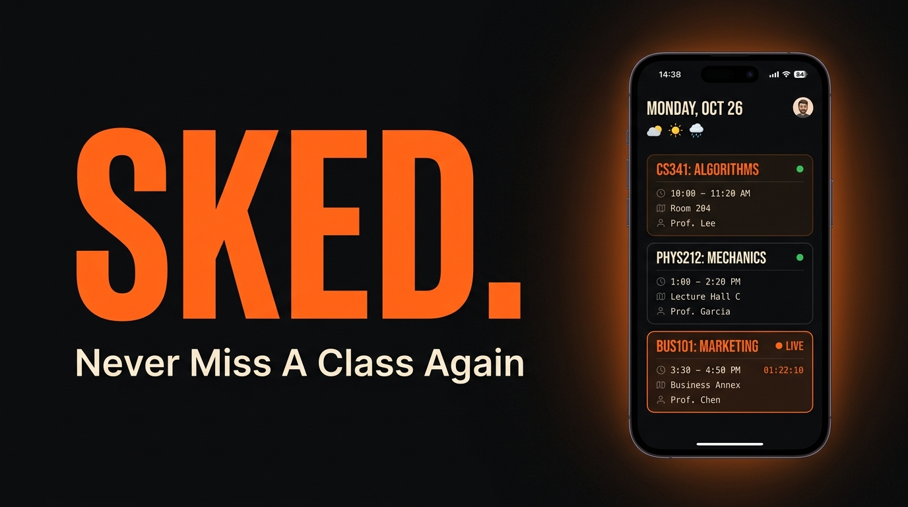

<p align="center">
  
</p>

<h1 align="center">SKED<span>.</span></h1>

<p align="center">
  <strong>Never Miss A Class Again</strong><br/>
  Real-time class schedule, live departures widget, zero LPU Touch conflicts, and pure relaxation on Sundays.<br/>
  100% on-device. Zero SaaS clutter. Zero tracking.
</p>

<p align="center">
  
  
  
  
</p>

---

## ✨ Features

### 📋 Live Departures Board
Inspired by European airport departures boards. Shows ongoing, upcoming, and finished classes with real-time **NOW.** live spotlight, room numbers, and teacher details.

### 🛡️ LPU Touch Compatible (Zero Session Conflict)
Pure Web UMS timetable scraping with zero mobile webservice calls. Keeps your official **LPU Touch** mobile app permanently logged in without single-device session invalidations.

### ☕ Sunday Bitmoji Chill Mode
Sundays are meant for relaxing. The widget automatically strips all academic stress and displays a centered chilling Bitmoji mascot with **"Enjoy your Sunday."**

### 🔒 100% On-Device Privacy
No third-party cloud servers, telemetry, or external proxies. All UMS authentication and HTML parsing happens directly inside your phone's secure storage.

### ⚡ 15-Min Background Auto Sync
Android WorkManager background updates periodically sync your timetable so your home screen widget always reflects your upcoming classes and room changes without opening the app.

### 📴 100% Offline Ready
UMS servers crash during 8:30 AM – 9:30 AM peak rush hours. Sked keeps your complete weekly timetable cached locally so you never miss your class or room number.

### 🔄 In-App OTA Updates (Android)
Automatic update detection linked to the Sked website. When a new version is uploaded, the app detects it and prompts the user with a single-tap update flow — download, install, done.

---

## 🏗️ Architecture (100% On-Device)

```
Sked/
├── sked-android/          Native Android app (Primary — Kotlin + Jetpack Compose)
│   ├── MainActivity.kt          Dashboard, Login, Class Cards, Update Dialog
│   ├── TimetableParser.kt       On-device HTML table extractor (no server needed)
│   ├── AboutDeveloperDialog.kt  Developer info + manual update check
│   ├── AppUpdateManager.kt      OTA update manager (fetch, download, install)
│   └── widget/
│       ├── TimetableWidget.kt          Glance home-screen widget
│       ├── TimetableWidgetReceiver.kt  Widget broadcast receiver
│       └── TimetableRefreshWorker.kt   Background sync worker
│
├── sked-app/              Flutter mobile client (iOS .IPA + cross-platform)
│   ├── lib/main.dart
│   ├── lib/screens/            today_screen, week_screen, settings_screen
│   ├── lib/theme/app_theme.dart
│   └── lib/widgets/class_card.dart
│
└── sked-web/              Landing page & download portal (Vite + React + TypeScript)
    ├── src/App.tsx
    ├── src/components/         Navbar, Hero, LiveMockup, WidgetPreview,
    │                           FeatureShowcase, InstallSteps, DeveloperCard
    └── public/
        ├── version.json        OTA update metadata (bump this to push updates)
        └── downloads/          APK & IPA distribution files
```

**No PC server or external proxy required.** The native Android app handles authentication, schedule parsing, storage, and widget updates entirely on your phone.

---

## 🎨 Design System

Built around a bold, logo-anchored visual identity: **Blaze orange on Ink near-black** with crisp departures-board typography.

| Token | Hex | Role |
|:---:|:---:|:---|
| **Ink** | `#0A0A0A` | Primary background — true near-black |
| **Slab** | `#141414` | Card/surface — subtle mechanical lift |
| **SlabElevated** | `#1C1C1C` | Elevated surfaces — dialogs, popovers |
| **Rule** | `#252525` | Hairline dividers and borders |
| **Chalk** | `#E8E6E3` | Primary text — warm off-white |
| **Slate** | `#7A7774` | Secondary/metadata text — warm mid-grey |
| **Blaze** | `#FF6B1A` | Logo orange — **the single chromatic accent** |

### Typography
- **Display**: Barlow Condensed Bold (700) — headlines, course codes, status tags (`SKED.`, `TODAY.`, `NOW.`)
- **Body & Times**: Inter + tabular monospace — times, room codes, sections
- **Structure**: Sharp `6dp` card radii, `4dp` inputs, monochrome `LEC` / `PRAC` / `TUT` badges

### Status Colors
| Status | Color | Hex |
|:---:|:---:|:---:|
| Present | 🟢 Green | `#22C55E` |
| Absent | 🔴 Red | `#EF4444` |
| Duty Leave | 🔵 Blue | `#38BDF8` |
| Unmarked | ⚫ Grey | `#3A3A3A` |

---

## 📱 Android — Build & Install

### Prerequisites
- Android Studio / Android SDK (API 34+)
- JDK 17+
- USB Debugging enabled on your phone

### Build Debug APK
```bash
cd sked-android
./gradlew assembleDebug
```

APK output: `sked-android/app/build/outputs/apk/debug/app-debug.apk`

### Install via ADB
```bash
adb install -r app/build/outputs/apk/debug/app-debug.apk
```

### Or use Gradle directly
```bash
./gradlew installDebug
```

---

## 🍎 iOS — Sideload via AltStore / SideStore

### Prerequisites
- iPhone / iPad running iOS 14.0+
- [AltStore](https://altstore.io/), [SideStore](https://sidestore.io/), or [Sideloadly](https://sideloadly.io/)
- Free Apple ID (7-day certificate) or paid Developer account (365-day)

### Steps
1. Download the `.ipa` file from the [Sked website](https://sked.tanishsarkar.com)
2. Open AltStore/SideStore on your iPhone → tap **"+"** in My Apps
3. Select the downloaded `sked-ios.ipa` → sign with your Apple ID
4. Go to **Settings → General → VPN & Device Management** → Trust the developer profile
5. On iOS 16+: Enable **Developer Mode** in Privacy & Security

> **Note:** iOS does not support automatic OTA updates. You'll need to re-sideload manually when a new version is released.

---

## 🌐 Website (sked-web)

The landing page serves as the download portal, feature showcase, and widget preview.

### Run Locally
```bash
cd sked-web
npm install
npm run dev
```

### Tech Stack
- **Vite** + **React** + **TypeScript**
- **Tailwind CSS** + **shadcn/ui** components
- **Framer Motion** animations
- **@paper-design/shaders-react** — Liquid Metal hero background

---

## 🔄 OTA Update System (Android)

When you release a new version:

1. **Build** the new APK
2. **Upload** it to `sked-web/public/downloads/sked-android.apk`
3. **Update** `sked-web/public/version.json`:

```json
{
  "versionCode": 3,
  "versionName": "2.0.0",
  "minSupportedVersion": 1,
  "releaseNotes": "• New feature X\n• Bug fix Y",
  "apkUrl": "https://your-domain.com/downloads/sked-android.apk",
  "directDownloadUrl": "/downloads/sked-android.apk",
  "fileSize": "20 MB",
  "updatedAt": "2026-10-01"
}
```

4. **Deploy** the website — all users will see the update prompt on next app launch

---

## 🏠 Home Screen Widget

The Jetpack Glance widget brings your schedule to the home screen:

- **Resizable**: 4×2, 4×3, 4×4, or 4×5
- **Auto-syncs** every 15 minutes via WorkManager
- **Color-coded** attendance status dots
- **Sunday mode**: Displays Bitmoji chill illustration
- **Tablet optimized**: Scales up to full-screen on any tablet size

### Add the Widget
1. Long-press on your home screen
2. Tap **Widgets** → Find **Sked**
3. Place the **Timetable Widget**
4. Resize to your preferred size

> **Tip:** Set Battery Usage for Sked to **Unrestricted** in Android App Info to ensure seamless 15-minute background syncs.

---

## 📂 Key Files Reference

| File | Purpose |
|:---|:---|
| `MainActivity.kt` | Main Compose UI — dashboard, login, cards, update dialog |
| `TimetableParser.kt` | On-device HTML table extraction from UMS |
| `AttendanceManager.kt` | Attendance tracking, history, weekly reset, course data |
| `CourseDetailScreen.kt` | Per-course attendance detail with session history log |
| `TimetableWidget.kt` | Jetpack Glance home-screen widget |
| `TimetableRefreshWorker.kt` | 15-min background WorkManager sync |
| `WeeklyResetWorker.kt` | Sunday 23:59 weekly attendance reset |
| `AppUpdateManager.kt` | OTA update — fetch, download, install APK |
| `AboutDeveloperDialog.kt` | Developer info + manual update check button |
| `version.json` | OTA update metadata — bump to push new versions |

---

## 👨‍💻 Developer

**Tanish Sarkar**

<p>
  <a href="https://www.instagram.com/tanishsarkar28/">
    
  </a>
  <a href="https://www.linkedin.com/in/tanish-sarkar28/">
    
  </a>
  <a href="https://github.com/tanishsarkar28">
    
  </a>
</p>

---

<p align="center">
  <strong>Built with ❤️ for LPU students</strong><br/>
  <sub>Kotlin • Jetpack Compose • Glance • Flutter • React • TypeScript</sub>
</p>
